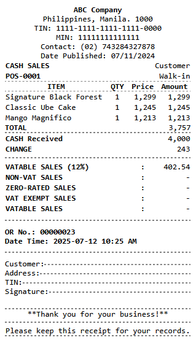

## React Receipt Slip
**The react-receipt-slip easiest way to create a receipt template.**

General use cases
- POS Receipt
- Bank Transaction Receipt
- Transportation ticketing

### Documentation
- [Documentation](#receipt-ui-components)
- [Examples](https://codesandbox.io/p/sandbox/7wtlkl)
- [My Portfolio](https://itsme-ychan.vercel.app)
- [MIT](https://github.com/devychan/react-receipt-slip/blob/main/LICENSE)

### Sample Output


### Installation

Run the following command

```bash
npm install react-receipt-slip
```

```js
import {
  DataTable,
  Dot,
  Line,
  Paper,
  RowText,
  TableCell,
  TableHead,
  TableRow,
  Text,
} from "react-receipt-slip";

const Receipt = () => {
    return <Paper>
        <Text align='center' bold>ABC Company</Text>
        <Text align='center'>Philippines, Manila. 1000</Text>
        <Text align='center'>TIN: 1111-1111-1111-1111-0000</Text>
        <Text align='center'>MIN: 11111111111111</Text>
        <Text align='center'>Contact: (02) 743284327878</Text>
        <Text align='center'>Date Published: 07/11/2024</Text>
        <DataTable>
            <TableRow>
                <TableCell><Text bold>CASH SALES</Text></TableCell>
                <TableCell><Text align='right'>Customer</Text></TableCell>
            </TableRow>
            <TableRow>
                <TableCell><Text bold>POS-0001</Text></TableCell>
                <TableCell><Text align='right'>Walk-in</Text></TableCell>
            </TableRow>
        </DataTable>
        <DataTable>
            <TableRow>
                <TableHead align='center'>ITEM</TableHead>
                <TableHead align='center'>QTY</TableHead>
                <TableHead align='right'>Price</TableHead>
                <TableHead align='right'>Amount</TableHead>
            </TableRow>
            <TableRow>
                <TableCell>Signature Black Forest</TableCell>
                <TableCell align='center'>1</TableCell>
                <TableCell align='right'>1,299</TableCell>
                <TableCell align='right'>1,299</TableCell>
            </TableRow>
            <TableRow>
                <TableCell>Classic Ube Cake</TableCell>
                <TableCell align='center'>1</TableCell>
                <TableCell align='right'>1,245</TableCell>
                <TableCell align='right'>1,245</TableCell>
            </TableRow>
            <TableRow>
                <TableCell>Mango Magnifico</TableCell>
                <TableCell align='center'>1</TableCell>
                <TableCell align='right'>1,213</TableCell>
                <TableCell align='right'>1,213</TableCell>
            </TableRow>
        </DataTable>
        <RowText>
            <Text bold>TOTAL</Text>
            <Text>3,757</Text>
        </RowText>
        <Dot />
        <DataTable>
            <TableRow>
                <TableCell><Text bold>CASH Received</Text></TableCell>
                <TableCell><Text align='right'>4,000</Text></TableCell>
            </TableRow>
            <TableRow>
                <TableCell><Text bold>CHANGE</Text></TableCell>
                <TableCell><Text align='right'>243</Text></TableCell>
            </TableRow>
        </DataTable>
        <Dot vmar={[5, 5]} />
        <DataTable>
            <TableRow>
                <TableCell><Text bold>VATABLE SALES (12%)</Text></TableCell>
                <TableCell><Text align='center'>:</Text></TableCell>
                <TableCell><Text align='right'>402.54</Text></TableCell>
            </TableRow>
            <TableRow>
                <TableCell><Text bold>NON-VAT SALES</Text></TableCell>
                <TableCell><Text align='center'>:</Text></TableCell>
                <TableCell><Text align='right'>-</Text></TableCell>
            </TableRow>
            <TableRow>
                <TableCell><Text bold>ZERO-RATED SALES</Text></TableCell>
                <TableCell><Text align='center'>:</Text></TableCell>
                <TableCell><Text align='right'>-</Text></TableCell>
            </TableRow>
            <TableRow>
                <TableCell><Text bold>VAT EXEMPT SALES</Text></TableCell>
                <TableCell><Text align='center'>:</Text></TableCell>
                <TableCell><Text align='right'>-</Text></TableCell>
            </TableRow>
            <TableRow>
                <TableCell><Text bold>VATABLE SALES</Text></TableCell>
                <TableCell><Text align='center'>:</Text></TableCell>
                <TableCell><Text align='right'>-</Text></TableCell>
            </TableRow>
        </DataTable>
        <Dot vmar={[10, 10]} />
        <Text bold>OR No.: 00000023</Text>
        <Text bold>Date Time: 2025-07-12 10:25 AM</Text>
        <Dot vmar={[10, 10]} />
        <RowText valign='bottom'>
            <Text>Customer: </Text>
            <Line />
        </RowText>
        <RowText valign='bottom'>
            <Text>Address: </Text>
            <Line />
        </RowText>
        <RowText valign='bottom'>
            <Text>TIN: </Text>
            <Line />
        </RowText>
        <RowText valign='bottom'>
            <Text>Signature: </Text>
            <Line />
        </RowText>
        <Dot vmar={[20, 0]} />
        <Text align='center'>**Thank you for your business!**</Text>
        <Dot vmar={[5, 5]} />
        <Text align='center'>Please keep this receipt for your records.</Text>
        <Dot vmar={[0, 0]} />
    </Paper>
}
export default Receipt
```


## Receipt UI Components

#### `<Paper>`

A container representing the receipt paper.

**Props:**
- `size?: number` — Width in **mm** (default: `80`).
- Accepts any child elements like `<Text>`, `<Line>`, `<RowText>`, etc.

---

#### `<Text>`

Styled text for receipt content.

**Props:**
- `align?: 'left' | 'center' | 'right'` — Text alignment.
- `bold?: boolean` — Bold text if `true`.
- `underlined?: boolean` — Underlined text if `true`.
- `italic?: boolean` — Italized text if `true`. *(v1.1.1)*

---

#### `<Line>`

A horizontal dashed line for separating sections.

**Props:**
- `margin?: [number, number]` — **[x, y]** spacing in pixels. *(v1.1.1)*

---

#### `<Dot>`

A thin horizontal element used for separating sections, with vertical spacing.

**Props:**
- `margin?: [number, number]` — **[x, y]** spacing in pixels. *(v1.1.0)*
---

#### `<RowText>`

A horizontal layout for aligning multiple `<Text>` elements.

**Props:**
- `padding?: [number, number]` — Padding [x, y] in pixels. *(v1.1.0)*
- `valign?: 'top' | 'bottom' | 'center'` — Vertical alignment of items. *(v1.0.9)*
- `space?: number` — Space between items. *(v1.1.0)*
- `justify?: 'start' | 'center' | 'between | 'end'` — Justify content horizontally. *(v1.1.0)*

---

#### `<DataTable>`

A styled block for rendering tabular data in receipt format.

**Props:**
- `bordered?: boolean` — Adds borders between rows/columns. *(v1.0.9)*
- `collapse?: boolean` — Removes outer margins/padding. *(v1.1.0)*

---

#### `<TableRow>`

Represents a single row in a `<DataTable>`.

**Props:**
- `align?: 'left' | 'center' | 'right'` — Default alignment for child `<TableCell>`s.

---

#### `<TableHead>`

Represents the table heading area.

**Props:**  
_None_

---

#### `<TableCell>`

A single cell inside a `<TableRow>`.

**Props:**
- `align?: 'left' | 'center' | 'right'` — Horizontal alignment of content.

---

#### `<Space>`

A helper spacer for vertical and horizontal gaps.

**Props:**
- `size?: [number, number]` — **[x, y]** space in pixels. Default: `[5, 5]`

## Usage Example

[Sandbox](https://codesandbox.io/p/sandbox/7wtlkl)